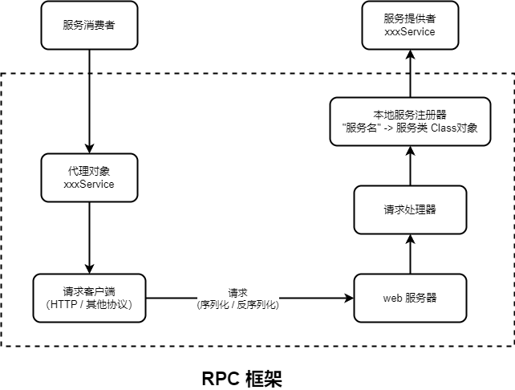

## h-rpc-base 架构图

## 全局配置加载

`RpcConfig` 全局配置类记录 hrpc 框架的全部配置选项并赋予初始值，通过 `RpcApplication` 使用双重检查锁单例模式来维护全局配置对象实例 `RpcConfig`，使用时只需调用 `RpcApplication.init()` 即可读取 `application-xxx.properties` 文件里默认以 **hrpc** 开头的配置。

## 消费方调用 - 动态代理

使用 **JDK 动态代理** 来拦截消费方的方法调用，然后把调用转换成远程请求（HTTP2）。

代理的职责是抽象出远程调用的细节，使得客户端代码看起来像是在调用本地方法，而实际上这些方法是在远程服务器上执行的。代理类充当了中介角色，屏蔽了底层的网络通信和序列化/反序列化等细节。

## 基于 Vert.x 搭建的提供者服务端

- Vert.x 采用基于事件驱动的**非阻塞异步 I/O**模型，类似于 Node.js。
- 使用少量的**事件循环**线程（Event Loop），通过异步编程模型来处理大量并发请求，不需要为每个请求分配一个线程。
- 这种模型适合处理高并发、高吞吐量的应用，尤其是 I/O 密集型的场景。

## 自定义序列化器 (SPI 机制)

系统内置了 JDK、JSON、KRYO、HESSIAN 的序列化器。

开发者可以自定义自己的序列化器（实现 `Serializer` 接口），并在 META-INF/rpc/custom 目录创建 `org.howard.hrpc.serializer.Serializer` 文件，以 `key=自定义序列化器的全类名` 注册自定义的序列化器，使用时在 `application-xxx.properties` 文件里配置 `hrpc.serializer=key` （**服务消费者和服务提供者都需要配置**）即可使用自定义序列化器。