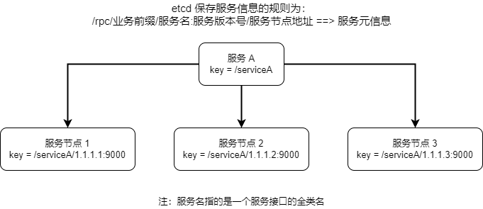
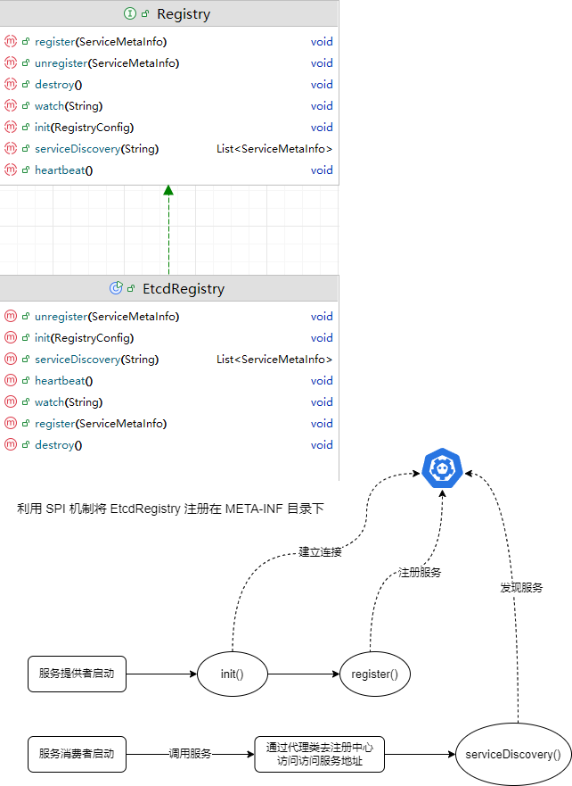
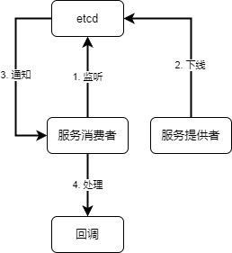
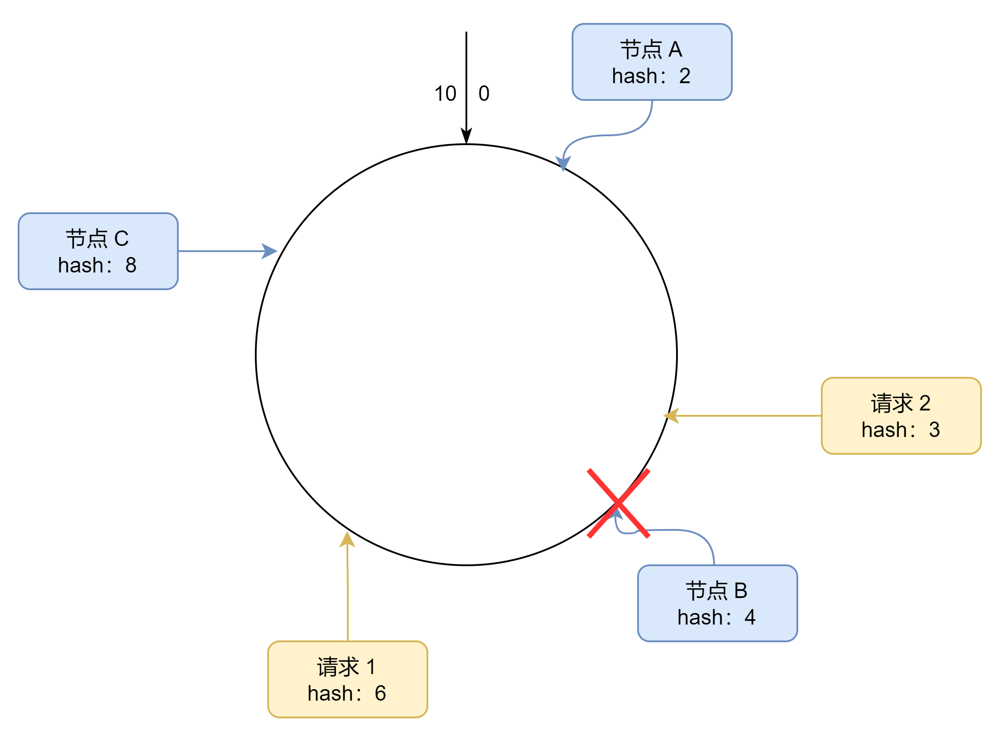
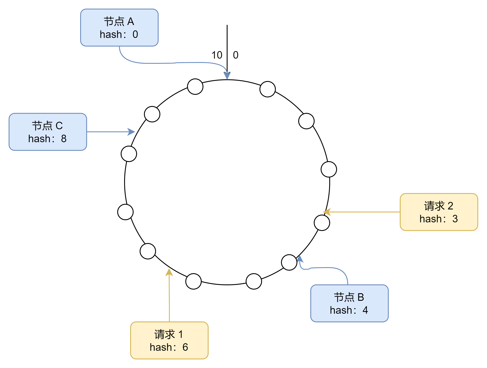

## 项目目录结构

```
example-common---------------- 示例的公共结构
example-consumer-------------- 服务消费者示例
example-provider-------------- 服务提供者示例
example-springboot-consumer--- 服务消费者示例 (springboot版本)
example-springboot-provider--- 服务提供者示例 (springboot版本)
h-rpc-base-------------------- hrpc 框架的精简版
h-rpc-core-------------------- hrpc 框架
   |-bootstrap---------------- 框架的启动目录
   |-config------------------- 框架的配置目录
   |-constant----------------- 常量目录
   |-fault-------------------- 错误相关
       |-retry---------------- 重试机制
       |-tolerant------------- 容错机制
   |-loadbalancer------------- 负载均衡
   |-model-------------------- 框架实体目录
   |-proxy-------------------- 动态代理 (服务消费端)
   |-registry----------------- 注册中心
   |-serializer--------------- 序列化
   |-server------------------- 服务端 (服务提供端)
   |-spi---------------------- SPI 可插拔机制
   |-utils-------------------- 工具
hrpc-spring-boot-starter------ hrpc 框架 (spring-boot-starter 版本)
```


## h-rpc-base 架构图


## 基础功能

### 全局配置加载

`RpcConfig` 全局配置类记录 hrpc 框架的全部配置选项并赋予初始值，通过 `RpcApplication` 使用双重检查锁单例模式来维护全局配置对象实例 `RpcConfig`，使用时只需调用 `RpcApplication.init()` 即可读取 `application-xxx.properties` 文件里默认以 **hrpc** 开头的配置。

### 消费方调用 - 动态代理

使用 **JDK 动态代理** 来拦截消费方的方法调用，然后把调用转换成远程请求（HTTP2）。

代理的职责是抽象出远程调用的细节，使得客户端代码看起来像是在调用本地方法，而实际上这些方法是在远程服务器上执行的。代理类充当了中介角色，屏蔽了底层的网络通信和序列化/反序列化等细节。

### 基于 Vert.x 搭建的提供者服务端

- Vert.x 采用基于事件驱动的**非阻塞异步 I/O**模型，类似于 Node.js。
- 使用少量的**事件循环**线程（Event Loop），通过异步编程模型来处理大量并发请求，不需要为每个请求分配一个线程。
- 这种模型适合处理高并发、高吞吐量的应用，尤其是 I/O 密集型的场景。

## 自定义序列化器 (SPI 机制)

系统内置了 JDK、JSON、KRYO、HESSIAN 的序列化器。

开发者可以自定义自己的序列化器（实现 `Serializer` 接口），并在 META-INF/rpc/custom 目录创建 `org.howard.hrpc.serializer.Serializer` 文件，以 `key=自定义序列化器的全类名` 注册自定义的序列化器，使用时在 `application-xxx.properties` 文件里配置 `hrpc.serializer=key` （**服务消费者和服务提供者都需要配置**）即可使用自定义序列化器。

## 注册中心

> 存储结构设计



> 注册中心的行为

```java
public interface Registry {
    /**
     * 初始化
     *
     * @param registryConfig
     */
    void init(RegistryConfig registryConfig);

    /**
     * 注册服务，服务端
     *
     * @param serviceMetaInfo
     */
    void register(ServiceMetaInfo serviceMetaInfo) throws Exception;

    /**
     * 注销服务，服务端
     *
     * @param serviceMetaInfo
     */
    void unregister(ServiceMetaInfo serviceMetaInfo) throws Exception;

    /**
     * 服务发现（获取服务节点列表），消费端
     *
     * @param serviceKey
     * @return
     */
    List<ServiceMetaInfo> serviceDiscovery(String serviceKey);

    /**
     * 服务销毁
     */
    void destroy();

    /**
     * 心跳检测（服务端）
     */
    void heartbeat();

    /**
     * 监听服务（消费端）
     * @param serviceKey
     */
    void watch(String serviceKey);
}
```

> 调用流程



### 心跳检测和续期机制

心跳检测（俗称 heartBeat）是一种用于监测系统是否正常工作的机制。它通过定期发送心跳信号（请求）来检测目标系统的状态。如果接收方在一定时间内没有收到心跳信号或者未能正常响应请求，就会认为目标系统故障或不可用，从而触发相应的处理或告警机制。

从心跳检测的概念来看，实现心跳检测一般需要两个关键：**定时**、**网络请求**。

使用 etcd 实现心跳检测会更简单一些，因为 etcd 自带了 key 过期机制，不妨换个思路：利用服务注册的**续期机制**，给节点注册信息一个“生命倒计时”，让节点定期续期，重置自己的倒计时。如果节点已宕机，一直不续期，etcd 就会对 key 进行过期删除。

这样一来，利用服务注册的续期机制，既做到了定时，又完成了网络请求，既是续期又是心跳检测。

> 具体方案

1. 服务提供者向 etcd 注册自己的服务信息，并在注册时设置 TTL （生存时间）。etcd 在接收到服务提供者的注册信息后，会自动维护服务信息的 TTL，并在 TTL 过期时删除该服务信息。
2. 在注册中心初始化时开启心跳检测，心跳检测 `heartbeat()` 会定期检查当前节点所有的服务是否已经过期，如果没有过期则调用 `register()` 重新刷新过期时间（续期）。

### 服务节点下线机制

当服务提供者节点宕机时，应该从注册中心移除掉已注册的节点，否则会影响消费端调用，所以需要设计一套服务节点下线机制。

服务节点下线又分为：

- 主动下线：服务提供者项目正常退出时，主动从注册中心移除注册信息。
- 被动下线：服务提供者项目异常推出时，利用 etcd 的 key 过期机制自动移除。

利用 JVM 的 Shutdown Hook 就能实现。 JVM 的 Shutdown Hook 是 Java 虚拟机提供的一种机制，允许开发者在 JVM 即将关闭之前执行一些清理工作或其他必要的操作，在此删除当前节点在注册中心的服务信息即可。

### 消费端服务缓存

正常情况下，服务节点信息列表的更新频率是不高的，所以在服务消费者从注册中心获取到服务节点信息列表后，完全可以缓存在本地，下次就不用再请求注册中心获取了，能够提高性能。

使用缓存永远要考虑的一个问题就是数据一致性问题，此处也是，如果服务提供者节点下线了，如何让消费端及时知晓。这里也无需引入其他技术，利用 etcd 的监听机制。

监听机制允许 etcd 的客户端为一个键创建一个事件回调（PUT、DELETE），一旦这个键发生对应事件即可执行相应回调，在回调里面及时更新本地缓存。



## 负载均衡

在服务消费端从注册中心获取可用的服务列表后，通过负载均衡策略进行调用。

所谓“负载均衡”，就是把任务、工作合理的分配给多个工作者，从而分摊压力，保证工作效率以及大家正常工作。所以，负载均衡是一种用来分配网络或计算负载到多个资源上的技术。它的目的是确保每个资源都能够有效地处理负载、增加系统的并发量、避免某些资源过载而导致性能下降或服务不可用的情况。

常见的负载均衡算法有：

- 轮询 (Round Robir)：按照循环的顺序将请求分配给每个服务器，适用于各服务器性能相近的情况。
- 随机 (Random)：随机选择一个服务器来处理请求，适用于服务器性能相近且负载均匀的情况。
- 加权 (Weighted)：根据服务器的性能或权重分配请求，性能更好的服务器会获得更多的请求，适用于服务器性能不均的情况。
- 一致性哈希 (Consistent Hashing)：是一种经典的哈希算法，用于将请求分配到多个节点或服务器上，所以非常适用于负载均衡。

本框架实现了轮询、随机、一致性哈希三种负载均衡算法，下面重点解读一下一致性哈希算法：

### 一致性哈希 (Consistent Hashing)

一致性哈希 (Consistent Hashing) 的核心思想是选择一个哈希函数，将整个哈希值空间划分成一个首尾相连的环状结构，每个节点或服务器通过哈希函数计算后在环上占据一个位置，每个请求根据其哈希值映射到环上的一个点，然后顺时针寻找第一个大于或等于该哈希值的节点，将请求路由到该节点上。

从上面的定义来看好像也没什么特别的，其实不然，下面来看一看它的特别之处：

- **节点下线产生的系统波动**

假设 10 个节点进行轮询，在轮询时取模算法，只要节点数变了，那么之前 `hash(key) % 10` 变成了 `hash(key) % 9`，也就意味着大多数服务器处理的请求都要发生变化，对系统的影响巨大。

如下图所示，当节点 B 下线时，请求 2 会交给节点 C 来处理（顺时针寻找第一个大于或等于该哈希值的节点），而服务器 A 接收到的请求保持不变。



- **节点倾斜问题**

节点通过哈希函数时在哈希环上的分布可能是不均匀的，那么此时在概率上讲每个节点的权重就不同了，如图，节点 A 与节点 B 靠的非常近，意味着节点 A 的“领地”小，接受到的请求少。

通过为每个节点创建虚拟节点的方式来“扩充领土”或“削减领土”达到平衡，使得请求映射到环上时，每个节点被选中的机会尽量不要有太大偏差。



> 一致性哈希的实现

使用 `TreeMap` 充当哈希环，`TreeMap` 在 Java 中并没有直接表现为一个“环”，它是一个基于**红黑树**实现的有序映射（`SortedMap`）。它按键的自然顺序对键值对进行排序。因此，`TreeMap` 本质上是一个**线性结构**，而不是环形结构。

不过，在一致性哈希的实现中，可以通过一种巧妙的方式将 `TreeMap` 的线性结构**逻辑上模拟成一个“环”**。具体做法是将哈希值映射到 `TreeMap` 中的键，并且通过特定的方式查找最近的节点，从而模拟环形查找的过程。

> 负载均衡同样被设计成 SPI 可插拔的形式，开发者可自定义负载均衡算法

## 重试机制

在 RPC 发送请求调用服务时加入重试机制，重试机制基于 guava-retrying 库实现。

guava-retrying 是一个线程安全的 Java 重试类库，提供了一种通用方法去处理任意需要重试的代码，可以方便灵活地控制重试次数、重试时机、重试频率、停止时机等，并具有异常处理功能。

本框架提供了两种重试策略：

- 不重试。
- 固定时间间隔进行固定次数的重试

## 容错机制

容错是指系统在出现异常情况时，可以通过一定的策略保证系统仍然稳定运行，从而提高系统的可靠性和健壮性。

在分布式系统中，容错机制尤为重要，因为分布式系统中的各个组件都可能存在网络故障、节点故障等各种异常情况。要顾全大局，尽可挡除偶发 / 单点故暗对系统带来的整体响。

容错策略有很多种，常用的容错策略主要是以下几个：

1. Fai-Over 故障转移：一次调用失败后，切换一个其他节点再次进行调用，也算是一种重试。
2. Fail-Back 失败自动恢复：系统的某个功能出现调用失败或错误时，通过其他的方法，恢复该功能的正常。可以理解为降级，比如重试、调用其他服务等。
3. Fail-Safe 静默处理：系统出现部分非重要功能的异常时，直接忽略掉，不做任何处理，就像错误没有发生过一样。 
4. Fail-Fast 快速失败：系统出现调用错误时，立刻报错，交给外层调用方处理。

框架目前提供了快速失败和静默处理两种容错策略。

> 同样，开发者可以通过 SPI 来制定自己的容错方案

## 启动机制和注解驱动

基于 springboot starter 启动器开发了 springboot starter 版本的 hrpc 框架，使用 `@EnableRpc` 开启框架支持，`@RpcService` 标记服务，`@RpcReference` 注入服务，使用这三个注解来代替编码的繁琐，详情的消费端和服务端使用见 example-springboot-consumer 和 example-springboot-provider 示例。